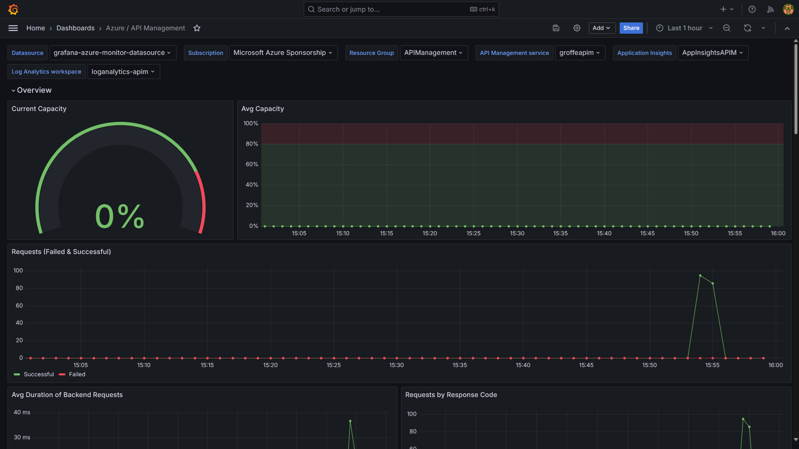

# Integração entre Azure API Management e Grafana
Instruções sobre configurações para tornar possível o monitoramento de um recurso do Azure API Managament a partir de uma instância do Grafana fora da nuvem Microsoft.

---

## Criando uma instância do Grafana via container para testes

Executar o comando a seguir:

```bash
docker run -d -p 3000:3000 --name=grafana grafana/grafana-enterprise
```

---

## Dashboard

Foi importado na instância do Grafana o seguinte dashboard:

[**Azure Monitor - Azure / API Management**](https://grafana.com/grafana/dashboards/16604-azure-api-management/)

---

## App Registration

A conexão com o recurso do Azure API Managament deverá ser feita através de uma **App Registration**, criada no tenant do Microsoft Entra ID da mesma subscription.

Alguns cuidados:

1) Configurar em **Authentication** para que sejam emitidos **Access Tokens** e **ID Tokens**:


2) Permissões a serem definidas em **API Permissions** (sempre como **Delegated**):


3) No **Resource Group** em que se encontram o **APIM**, **Application Insights** e **Log Analytics** conceder as permissões **Reader** e **Monitoring Reader** para a **App Registration**:


---

## Exemplo do dashboard em operação

Exemplo de **dashboard** acessado a partir de um container do Grafana:

